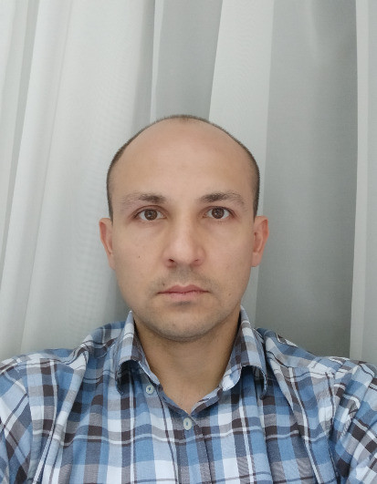

# <span style="color:blue">rsschool-cv</span>
# Askar Minigaliev


## *Contact information:*

#### Phone: +7 919 60 70 897
#### E-mail: askarikus@yandex.ru
#### Telegram: @AskarMini
#### GitHub: Askarikus
#### Discord: Askarikus

## *About Me:*
    I am a load testing engineer. I have been interested in web programming for a long time,     
    until recently I developed as a backend specialist. But I became a tester.     
    As an extension of my horizons, I am now interested in front-end development.

    
## *Skills:*
+ HTML, CSS, Git
+ Python, Django, Pandas
+ Javascript
+ Intellij PyCharm
+ VSCode
+ Jmeter


## *Code example:*
#### Simultaneous Equations - Three Variables
``` 
import numpy

def solve_eq(eq):
    in_mass = [e[:3] for e in eq]
    out_mass = [e[-1] for e in eq]
    m = numpy.array(in_mass)
    v = numpy.array(out_mass)    
    return [round(i) for i in numpy.linalg.solve(m,v)]
    
```


## *Experience:*

+ internship Performance testing Engineer in PerformanceLab
+ testing engineer in Wahelp
  
## *Education:*
    Ufa State Aviation Technical University
    HackerRank
    HackerEarth
    Leetcode
    Stepik

## *Languages:*

   *  Russian - native
   *  English - A2
